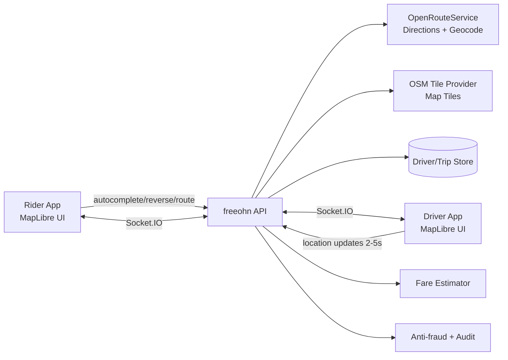

# Open-Source Map API Blueprint (Google Maps Alternative)

This blueprint defines a production-ready map stack for **freeohn’s taxi app** using free/open-source providers and the current backend/frontend architecture.

## 1) Stack Selection (Aligned to Your Requirements)

- **Map UI:** MapLibre (`maplibre-gl` web, `@rnmapbox/maps` for native SDK bridge).
- **Map Data:** OpenStreetMap tiles/data via a managed tile provider (or self-hosted tiles).
- **Routing + ETA + Geocoding:** OpenRouteService (ORS).
- **Realtime Tracking:** Socket.IO over Node.js (`server/modules/location/socket.gateway.ts`).
- **Nearby Drivers:** Existing radius search, with upgrade path to PostGIS/H3.
- **Fare Estimation:** Existing pricing service fed by route distance/duration.
- **Safety/Anti-fraud:** Existing stale-location and suspicious-jump checks.

## 2) Current Backend Support You Already Have

### Maps API (ORS-backed, Google-like features)

Use the existing tRPC maps router:

- `maps.placesAutocomplete`
- `maps.reverseGeocode`
- `maps.computeRoute`

These already support:

- Caching + rate-limit guardrails
- Zambia country bias default (`ZM`)
- ORS fallback behavior if API key is absent

Implementation location: `server/routers/maps.router.ts`

### Taxi Core (Realtime + Trip Lifecycle)

Use existing server modules:

- Realtime socket gateway: `server/modules/location/socket.gateway.ts`
- Driver location ingest/streaming: `server/modules/location/location.service.ts`
- Trip state machine: `server/modules/trips/fsm.ts`
- Nearby drivers + trip orchestration: `server/modules/trips/trip.service.ts`
- HTTP endpoints: `server/modules/http/ride-hailing.router.ts`

## 3) Architecture (matches your image flow)



## 4) API Contract You Can Implement Immediately

### A. Address search (pickup/drop typing)

- `maps.placesAutocomplete({ query, location? })`

Returns place predictions with coordinates.

### B. Reverse geocode pin

- `maps.reverseGeocode({ lat, lng })`

Returns human-readable address for map pin.

### C. Route + ETA

- `maps.computeRoute({ origin, destination, travelMode: "DRIVE" })`

Returns:

- `distanceMeters`
- `durationSeconds`
- `encodedPolyline`
- turn steps

### D. Nearby drivers

HTTP endpoint already available:

- `POST /api/drivers/nearby`

Body:

```json
{
  "pickup": { "lat": -15.4067, "lng": 28.2871 },
  "radiusKm": 6,
  "limit": 12
}
```

### E. Live driver tracking

Socket events already available:

- `trip:subscribe`
- `trip:unsubscribe`
- server push `trip:event`

## 5) Frontend Integration Pattern (MapLibre)

1. Render tile style URL from OSM provider in MapLibre map component.
2. On pickup/drop input, call `placesAutocomplete`.
3. On map drag pin, call `reverseGeocode` (debounced).
4. On route confirmation, call `computeRoute`, decode polyline, draw line layer.
5. Subscribe rider to trip socket room after trip creation.
6. Animate driver marker on incoming `driver.location` events.
7. Rotate driver marker with `heading` to face movement direction.
8. Continuously refresh nearby drivers before assignment.

## 6) Production Hardening Checklist

- **Do not use public OSM tile endpoints at scale.** Use a paid OSM-hosted tile CDN or self-host vector tiles.
- Keep ORS API key server-side only.
- Apply per-user/IP rate limiting for maps and location writes.
- Mark drivers offline if no update for >15s.
- Reject suspicious location jumps/speeds.
- Persist trip location history for audits/disputes.

## 7) Recommended Next Upgrade (Scale)

Current nearby-driver flow is suitable for MVP. For larger fleet size:

1. Add PostGIS (`POINT`, `GIST`) or H3 index.
2. Replace broad in-memory filtering with radius SQL query.
3. Add city partitioning/sharding for dispatch queues.
4. Add Redis pub/sub for multi-instance Socket.IO fanout.

## 8) Environment Variables (Map Stack)

```bash
# ORS
ORS_API_KEY=...
ORS_BASE_URL=https://api.openrouteservice.org
ORS_TIMEOUT_MS=4500
ORS_COUNTRY_BIAS=ZM

# cache / map rate limiting
MAPS_CACHE_TTL_MS=45000
MAPS_RATE_WINDOW_MS=60000
MAPS_RATE_MAX=120

# ride-hailing realtime behavior
RIDE_HAILING_DRIVER_STALE_AFTER_MS=15000
RIDE_HAILING_DRIVER_LOCATION_MAX_SPEED_KMH=180
RIDE_HAILING_DRIVER_LOCATION_MAX_JUMP_METERS=800
RIDE_HAILING_DRIVER_LOCATION_MAX_JUMP_WINDOW_MS=5000
```

## 9) Why This Is a Google-Maps-Like Alternative

You get equivalent taxi-critical behavior without Google lock-in:

- Interactive map UI and marker animation (MapLibre)
- Global road/place data (OSM)
- Directions + ETA + geometry (ORS)
- Real-time dispatch tracking (Socket.IO)
- Nearby driver search + trip state machine + fare logic (existing backend modules)

This gives you an implementable, cost-controlled architecture that already matches most of your current codebase.
